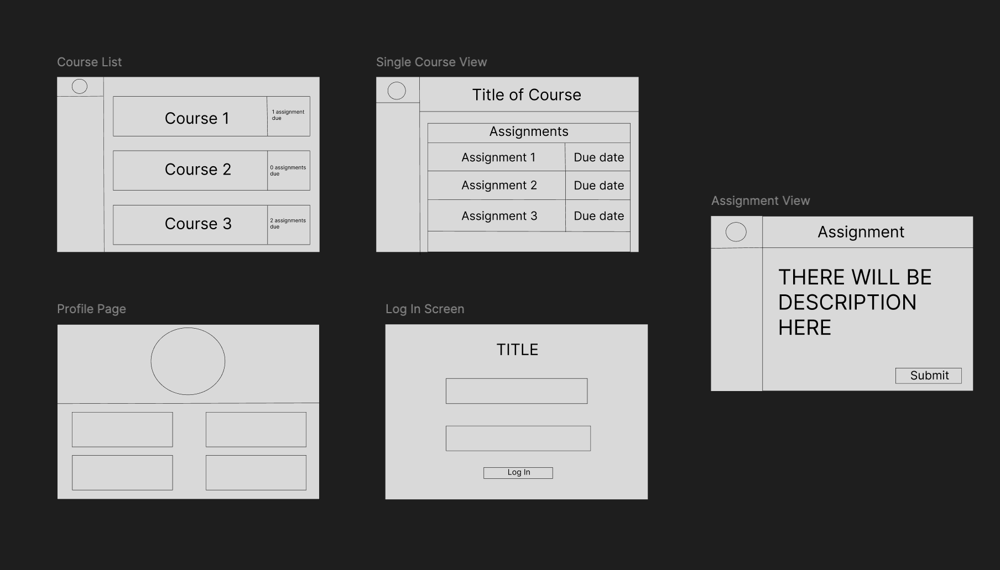

# Requirements:

    - Students should be able to view their courses 
    - Students should be able to see what assignments they need to submit
    - Students should be able to view feedback from their assignments
    - Instructors should be able to add, edit, and remove assignments
    - Instructors should be able to see which students have submitted assignments
    - Instructors should be able to give some sort of feedback/grade on assignments
    - Administrators should be able to add/delete courses
    - Administrators should be able to enroll/remove students from courses

# Site Map: 

# Wireframes:
